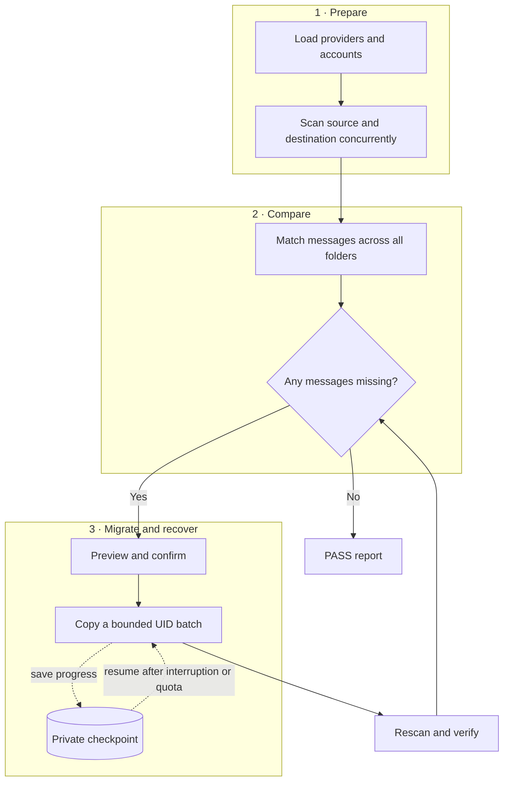

# Yandex Business 360 Migrate to Other IMAP Email (Yandex Escape)


**Yandex Escape is a concurrent IMAP email migration tool and IMAP migration
verifier.** It copies messages that are missing from a destination mailbox,
then proves the result at message level. It began as a Yandex Mail migration to
[BeautifulHosting Hosting](https://www.guzel.net.tr/aff.php?aff=1312), a server hosting
company in Türkiye, and now supports custom IMAP source and destination servers.
The codebase is provider-agnostic; Yandex and BeautifulHosting are the example
configuration, not requirements.

Folder totals alone are a weak migration test: mail may land in another folder,
the destination may receive new messages after an MX switch, and equal counts
can still hide different messages. Yandex Escape inventories both mailboxes,
matches individual messages, migrates only missing source UIDs with `imapsync`,
and rescans the destination before reporting **PASS** or **FAIL**.

> [!IMPORTANT]
> This tool reads private mailbox data and can copy messages to the destination.
> Start with `--dry-run`, review the proposed work, and keep account files and
> reports private. It never deletes, moves, or overwrites source messages.

## Why Yandex Escape exists

> **Your old mailbox is still readable. Make sure it is also portable—and prove
> that nothing was left behind.**

Yandex ended the grandfathered free version of Yandex 360 for Business on
December 8, 2025. According to its
[official transition FAQ](https://yandex.com/support/yandex-360/business/purchase/en/troubleshooting/faq-disable-free-version),
affected organizations receive a transition notice and have seven days to
activate a paid plan. Without payment, services become view-only: existing
organizational data is preserved, email remains readable, and Disk files remain
downloadable. That creates a practical migration window, but administrators
should not assume IMAP access will remain available indefinitely in every
account state or region.

As checked in June 2026, Yandex's international list prices are examples of the
new ongoing cost:

- Basic: **$3.99 per user/month**
- Optimal: **$6.49 per user/month**
- Advanced: **$16.99 per user/month**

Plan names, prices, taxes, currencies, eligibility, and transition dates vary
by billing region. Yandex's
[plan-change FAQ](https://yandex.ru/support/yandex-360/business/purchase/en/troubleshooting/faq-plans-changes)
says pricing and features may be reviewed annually, so use the
[live Yandex 360 pricing page](https://360.yandex.com/business/tariff/) rather
than treating these figures as permanent.

Yandex Escape helps organizations move email history from Yandex—or any other
IMAP provider—to another IMAP mailbox. It scans both sides, copies only missing
messages, and verifies the result message by message. That is stronger evidence
than comparing mailbox or folder totals alone.

## Why use it?

- **Message-level verification.** Unique `Message-ID` values are matched first;
  ambiguous or missing IDs use a semantic fingerprint of the message body,
  addresses, date, subject, and attachments.
- **Safe mailbox migration.** Only source messages missing anywhere on the
  destination are selected for copying.
- **Concurrent migration.** Multiple accounts are processed simultaneously,
  with bounded metadata, body, and copy batches.
- **Failure recovery.** Private checkpoints resume interrupted work, transient
  IMAP failures are retried, and full destination mailboxes pause safely.
- **Useful evidence.** Permission-restricted text and JSON reports explain what
  was checked, copied, found in another folder, or left unresolved.

This makes Yandex Escape useful as a Yandex mail migration utility, a general
mailbox migration assistant, an imapsync verification layer, and a missing
email detection tool after an IMAP migration.

Yandex also uses IMAP for supported migration paths and explicitly recommends
saving migration logs so errors can be traced across runs. Yandex Escape follows
the same operational principle with private reports and resumable checkpoints.

### What it does not migrate

Yandex Escape migrates **email messages and their IMAP folder placement only**.
IMAP does not carry contacts, calendars, Yandex Disk files, aliases, forwarding
rules, filters, shared mailboxes, or organization settings. Export or recreate
those separately before decommissioning the source service.

## How the migration works



## Requirements

- Node.js 20 or newer
- `imapsync` for real migrations (a dry run only scans with IMAP)
- IMAP enabled on both providers
- An application password when a provider requires one

On macOS:

```sh
brew install imapsync
```

On Linux, install `imapsync` with your distribution package manager or follow
the [upstream imapsync installation instructions](https://imapsync.lamiral.info/#install).
Windows users can run Yandex Escape in WSL.

## Five-minute Yandex-to-BeautifulHosting migration

BeautifulHosting Hosting is the destination used by the original migration and the
included example configuration. If you need hosting in Türkiye, the banner below uses
the maintainer's affiliate link. It may earn the maintainer a commission at no
additional cost to you.

<a href="https://www.guzel.net.tr/aff.php?aff=1312"></a>

Clone and install:

```sh
git clone https://github.com/gokhanozdemir/email-migration-verify.git
cd email-migration-verify
npm ci
cp migration.example.json migration.json
cp accounts.example.json accounts.json
```

Edit `accounts.json` with one object per mailbox:

```json
[
  {
    "email": "person@example.com",
    "sourcePassword": "yandex-app-password",
    "destinationPassword": "guzel-password"
  }
]
```

The example `migration.json` contains the complete provider settings:

```json
{
  "source": {
    "name": "Yandex",
    "host": "imap.yandex.com",
    "port": 993,
    "secure": true
  },
  "destination": {
    "name": "BeautifulHosting",
    "host": "mail.guzel.net.tr",
    "port": 993,
    "secure": true,
    "legacyGreetingCapabilities": true,
    "loginMethod": "LOGIN"
  }
}
```

For Yandex 360 for Business, enable IMAP, authenticate with the full email
address, and create a Mail application password. Yandex's current documented
incoming settings are `imap.yandex.com`, SSL, port `993`; see the
[official Yandex IMAP instructions](https://yandex.com/support/yandex-360/business/mail/en/mail-clients/others).
If a regional or legacy account uses another endpoint, change `source.host` in
`migration.json`.

Protect the credentials file, then audit without copying:

```sh
chmod 600 accounts.json
npm run migrate -- --config migration.json --accounts accounts.json --dry-run
```

Run the migration:

```sh
npm run migrate -- --config migration.json --accounts accounts.json
```

After scanning, each account with missing messages shows the exact copy count:

```text
person@example.com: copy 12 missing message(s) from Yandex to BeautifulHosting.
Type "yes" to continue: yes
```

Automation may pass `--yes`. Do this only after reviewing a dry run:

```sh
npm run migrate -- --config migration.json --accounts accounts.json --yes
```

## Custom IMAP providers

Both sides use explicit connection settings:

```json
{
  "source": {
    "name": "Old mail server",
    "host": "imap.old.example",
    "port": 993,
    "secure": true
  },
  "destination": {
    "name": "New mail server",
    "host": "imap.new.example",
    "port": 993,
    "secure": true,
    "authMechanism": "PLAIN"
  }
}
```

No provider endpoints are hard-coded in the application. Advanced compatibility
fields are `authMechanism`, `loginMethod`, and
`legacyGreetingCapabilities`.

Use implicit TLS (`"secure": true`) whenever the provider supports it. With
unencrypted IMAP, credentials and mail can cross the network in clear text.

## Options

```text
--config <path>      Provider configuration
--accounts <path>    JSON account credentials
--days <n>           Audit only the most recent N days
--concurrency <n>    Accounts processed simultaneously (default: 3)
--report-dir <path>  Private report/checkpoint directory (default: reports)
--dry-run            Scan and report without copying
--yes                Approve proposed copies without prompting
--force              Reverify accounts that already passed
--restart            Reinventory failed or paused accounts
```

The default audit covers the complete mailbox history. For a faster recent-mail
check, use `--days 7`; the destination scan includes a two-day safety buffer.

### Concurrency and memory bounds

`--concurrency` controls how many account migrations run at once. Start with
the default of three and lower it if a provider rate-limits connections.
Within each account, metadata is fetched in groups of 250 messages, ambiguous
full bodies in groups of 25, and missing UIDs are copied in groups of 200.

## Reports and expected results

At completion, the CLI prints an Inbox timeline and verification summary:

```text
Verification summary
┌──────────────────────┬────────┬─────────┬────────┬───────────┬────────────┬─────────┐
│ Account              │ Result │ Checked │ Copied │ Elsewhere │ Unresolved │ Seconds │
├──────────────────────┼────────┼─────────┼────────┼───────────┼────────────┼─────────┤
│ person@example.com   │ PASS   │   12840 │     12 │         3 │          0 │   42.8  │
└──────────────────────┴────────┴─────────┴────────┴───────────┴────────────┴─────────┘
Overall: PASS
```

A run passes only when no audited source message remains unresolved. A message
found in a different destination folder is reported but not copied.

Reports are written as permission-`0600` JSON and text files. They contain
email addresses, subjects, senders, dates, folders, message IDs, and semantic
hashes. Treat the whole report directory as private; its deny-all `.gitignore`
is defense in depth, not a substitute for access control.

## Failure recovery

- **Interrupted process:** rerun the same command. The checkpoint is validated,
  the destination is reconciled, and only work still missing is resumed.
- **Destination quota:** free space and rerun. Other accounts continue while the
  full account remains `PAUSED (QUOTA)`.
- **Transient IMAP/imapsync failure:** one retry occurs automatically before the
  account is marked failed.
- **Stale or unwanted checkpoint:** use `--restart` to rebuild the inventory for
  failed and paused accounts.
- **Previously successful account:** it is skipped by default. Use `--force` to
  perform a fresh verification.

Checkpoints contain message metadata and UIDs, never passwords or message
bodies. Passwords are passed to `imapsync` through temporary permission-`0600`
files and are removed afterward.

For broader migration planning, Yandex's own
[IMAP migration documentation](https://yandex.ru/support/yandex-360/business/admin/en/migration/mail/exchange)
shows why retaining logs matters when multiple runs or partial failures occur.

## Migrating from the old text account format

The old format remains readable for one compatibility release:

```text
email:yandex-password:guzel-password
```

Move each row into `accounts.json` as `email`, `sourcePassword`, and
`destinationPassword`. JSON supports passwords containing colons and gives
clear provider-neutral field names. Do not commit either format.

## Troubleshooting

- **Authentication failed:** verify the username, enable IMAP, and create an app
  password if normal account passwords are rejected.
- **`imapsync` is not installed:** install it before a real migration; dry runs
  do not need it.
- **Connection or TLS timeout:** confirm the hostname, port, firewall, and
  `secure` setting in `migration.json`.
- **Messages remain unresolved:** inspect the private report, rerun once, and
  use `--restart` only when you intentionally want a fresh inventory.
- **Provider throttling:** reduce `--concurrency`.

## Development and security

Run the test suite with `npm test`. Contributions are welcome; see
[CONTRIBUTING.md](CONTRIBUTING.md). Report vulnerabilities privately according
to [SECURITY.md](SECURITY.md).

Yandex Escape is available under the [MIT License](LICENSE).
